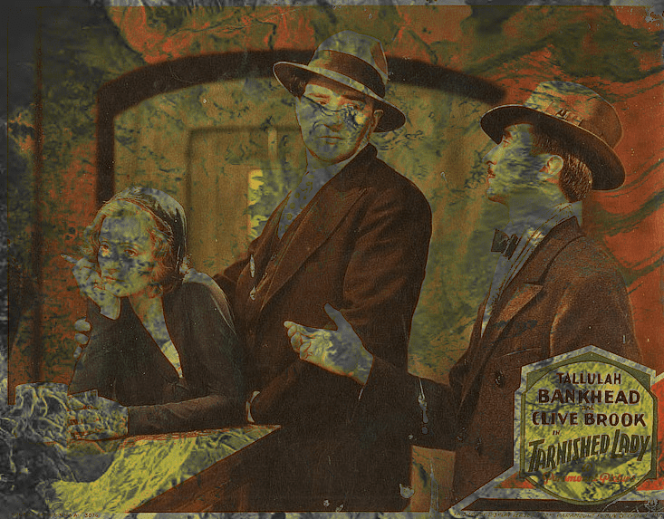

# TDLDL

TDLDL is ~an old app that lives at the school~ a Flask-based Python 3 app that generates or processes images in its own unique way. I created it to perform Mario Paint-like stamp floodfills on images, and it grew from there.

It is meant to be used for a single user on their machine, and the user is a developer or at least not scared of code. Active changes during use are recommended. Pretend I figured out how to write that sentence in the active voice, too.

Your grandma will hate it, because she will not understand it.

Your mom will hate it, because it does surreal hoodrat shit to images and the output is weird.

Your dad will hate it because he's an abusive asshole and hates anything cool.

I can't explain it better than that because no one else does image operations like this, because it is stupid.

## Prerequisites

Before you begin, ensure you have met the following requirements:

* Prepare your anus
* TDLDL is not more scared of you than you are of it. You **should** be scared of it
* You have read either *House of Leaves* or listened to 4'33" more than once.
* TDLDL was originally called TDL. I don't remember what TDL meant
* Actually it was originally called "imageTDL3.py" if that floats your boat somehow

## Actual Prerequisites

* Python 3.8+
* Flask
* NumPy
* OpenCV_Python
* Pillow (PIL)
* dude just look at requirements.txt (Ollama is used but optional, it's imported when needed)
    * TODO: add some config flags to turn off certain features
* Dictionaries and word files placed in a directory (specified in the source file, tdldl.py).
    * __(!) ABSOLUTELY MANDATORY__
    * Can be acquired from Project Gutenberg and various other websites (look for Moby)
    * I can't distribute them because some are free but not distributable
    * TODO: document what is actually needed in a way that doesn't make me look like a dipshit
* pillow_simd (Linux) highly recommended
    * (I'm running it in WSL on Windows with Ubuntu 20)
    * original development was done on Windows in Python 2, and will work with regular-ass Pillow, but it will be slow
* Macs are evil and I don't know if they can handle this shit
    * They probably can but I can't help you do it
* The directory needs to be writable, and should probably be allowed to create writable directories

## Installing TDLDL

To install TDLDL, follow these steps:

* Download the source and extract to a folder, or `git clone`
* Edit the source to assign your parameters
    * TODO: move these to a config file like a normal person
* Put some images in `/sourceimages` because most of the operations won't work without images to pull from
* Pray, because my installation has not had a fresh install since I moved it to Linux a few years ago
* It started from scratch when I kicked the project off in 2009 and I just moved the Windows dirs to Linux so, seriously, find a deity to believe in and pray to them
    * Lucifer or Archangel Raphael recommended, because I'm them (literally)
    * Azazel not recommended (he will laugh at you)
* Run `python tdldl.py` and hope that port 5000 is open

## Using TDLDL

To use TDLDL, follow these steps:

* Go to `http://localhost:5000` in your browser once it has started
* idk, click around some of the functions and see what they look like

## Sample images

Here are some things I've made with TDLDL.

__mix2_public():__

__textGrid():__

__wordGrid2():__

__radioFill_recurse():__

__floodSample(), using CGA Mode 1 4-color:__

This demonstrates each floodFill algorithm available in TDLDL.

## Contributing to TDLDL

Don't. This is my baby and sending me a pull request is like trying to date my 15 year old daughter. (TDLDL was literally born in 2009).

But feel free to fork it.

## Contributors

Thanks to the following people who have contributed to this project:

* [me](https://github.com/npnance) 
* no one else worked on this thing ever

## Contact

Email in the profile.

## License

[TDLDL](https://github.com/npnance/TDLDL) © 2009-2024 by [Natali Nance](https://github.com/npnance/) is licensed under [Creative Commons Attribution-NonCommercial-ShareAlike 4.0 International](https://creativecommons.org/licenses/by-nc-sa/4.0/).

**Commercial use is prohibited, whether it is the application itself or the images/text it creates.** For commercial licensing, you MUST contact me. I have put hundreds of Friday night hours into building TDLDL. "I’ve got this thing and it’s fucking golden, and, uh, uh, I’m just not giving it up for fuckin’ nothing. I’m not gonna do it. And, and I can always use it. I can parachute me there.” — Former Governor and convicted felon Rod Blagojevich

## That's all for now

* The End
* No Moral